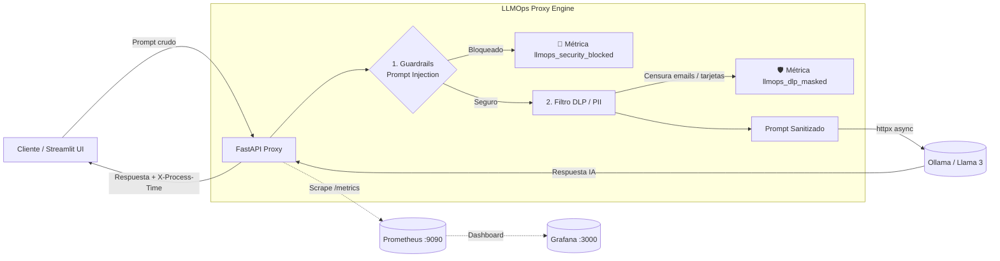

# 🛡️ LLMOps Proxy

[](https://www.python.org/)
[](https://fastapi.tiangolo.com/)
[](https://streamlit.io/)
[](https://ollama.com/)
[](https://prometheus.io/)
[](https://www.docker.com/)

**LLMOps Proxy** es un proxy interceptor inteligente, seguro y de alto rendimiento diseñado para intermediar la comunicación entre aplicaciones cliente y Grandes Modelos de Lenguaje (LLMs). 

Actúa como una pasarela de seguridad (*API Gateway*) que aplica validaciones contra **Prompt Injection**, censura información confidencial (**DLP / PII Masking**), recopila **métricas de observabilidad en tiempo real** con Prometheus y proporciona una interfaz conversacional moderna con **Streamlit**.

---

## 📑 Tabla de Contenidos
- [Arquitectura y Flujo de Peticiones](#-arquitectura-y-flujo-de-peticiones)
- [Características Principales](#-características-principales)
- [Estructura del Proyecto](#-estructura-del-proyecto)
- [Requisitos Previos](#-requisitos-previos)
- [Instalación y Configuración](#-instalación-y-configuración)
- [Puesta en Marcha](#-puesta-en-marcha)
  - [Opción 1: Automática en Windows (Recomendada)](#opción-1-automática-en-windows-recomendada)
  - [Opción 2: Inicio Manual por Servicios](#opción-2-inicio-manual-por-servicios)
  - [Opción 3: Entorno Contenerizado (Docker Compose)](#opción-3-entorno-contenerizado-docker-compose)
- [Endpoints de la API](#-endpoints-de-la-api)
- [Métricas y Observabilidad](#-métricas-y-observabilidad)
- [Ejecución de Pruebas](#-ejecución-de-pruebas)

---

## 🏗️ Arquitectura y Flujo de Peticiones



---

## ✨ Características Principales

1. **Guardrails & Seguridad Activa (`app/guardrails/`):**
   - **Detección de Prompt Injections:** Bloquea patrones maliciosos, instrucciones de escape de contexto y jailbreaks comunes (p. ej., *"ignora las instrucciones"*, *"modo dan"*).
   - **Expresiones Regulares Pre-compiladas:** Optimizado en memoria para evaluar texto en microsegundos sin retrasar la respuesta.

2. **Protección contra Fuga de Datos (DLP / PII Masking):**
   - Detecta y censura correos electrónicos reemplazándolos por `[EMAIL_PROTEGIDO]`.
   - Enmascara cadenas que correspondan a números de tarjetas de crédito o secuencias telefónicas con `[NUMERO_PROTEGIDO]`.

3. **Cliente Asíncrono Resiliente con Reintentos (`app/services/`):**
   - Conexión a Ollama mediante cliente HTTP asíncrono (`httpx`).
   - Política de reintentos rápidos automáticos (backoff exponencial breve) y control estricto de timeout (10s) para evitar bloqueos por cuelgues del servicio local.

4. **Observabilidad y Métricas LLMOps:**
   - Métricas de Prometheus personalizadas (`llmops_security_blocked_total`, `llmops_dlp_masked_total`).
   - Middleware de latencia (`TimingMiddleware`) que inyecta la cabecera `X-Process-Time` y registra la latencia por endpoint en los logs.
   - Endpoint `/metrics` expuesto vía `prometheus-fastapi-instrumentator`.

5. **Interfaz de Chat en Tiempo Real:**
   - Aplicación construida en **Streamlit** (`app_ui.py`) con historial de conversación interactivo y feedback visual ante eventos de seguridad o errores.

---

## 📂 Estructura del Proyecto

```text
llmops-proxy/
├── app/
│   ├── api/
│   │   ├── __init__.py
│   │   └── routes.py             # Endpoints /chat y modelos de entrada/salida Pydantic
│   ├── core/
│   │   ├── metrics.py            # Contadores de Prometheus (DLP y Guardrails)
│   │   └── middlewares.py        # Logging estructurado y medición de latencia
│   ├── guardrails/
│   │   ├── pii_filter.py         # Filtro DLP para censura de PII (emails, números)
│   │   └── prompt_check.py       # Detección y bloqueo de prompt injections
│   ├── services/
│   │   └── llm_client.py         # Cliente HTTP asíncrono para Ollama con reintentos
│   ├── __init__.py
│   └── main.py                   # Inicialización y configuración de FastAPI
├── tests/
│   ├── pytest.ini               # Configuración del entorno de pruebas
│   └── test_proxy.py             # Tests unitarios y de integración con TestClient
├── app_ui.py                     # Interfaz de usuario conversacional en Streamlit
├── docker-compose.yml            # Orquestación de Proxy, Prometheus y Grafana
├── Dockerfile                    # Imagen Docker optimizada (Python 3.11-slim)
├── iniciar_app.bat               # Script automatizado para Windows (Ollama + FastAPI + Streamlit)
├── prometheus.yml                # Configuración de scrapeo para Prometheus
├── requirements.txt              # Dependencias del proyecto
└── README.md                     # Documentación técnica
```

---

## ⚙️ Requisitos Previos

- **Python 3.11 o superior**.
- **Ollama** instalado en el sistema ([Descargar Ollama](https://ollama.com/download)).
- **Docker y Docker Compose** (opcional, si deseas levantar Prometheus y Grafana).

Descarga el modelo por defecto (`llama3`) ejecutando en tu terminal:
```bash
ollama pull llama3
```

---

## 📦 Instalación y Configuración

1. **Clonar el repositorio:**
   ```bash
   git clone https://github.com/MattMattia/llmops-proxy.git
   cd llmops-proxy
   ```

2. **Crear y activar un entorno virtual:**
   - **En Windows:**
     ```cmd
     python -m venv .venv
     .venv\Scripts\activate
     ```
   - **En Linux / macOS:**
     ```bash
     python3 -m venv .venv
     source .venv/bin/activate
     ```

3. **Instalar dependencias:**
   ```bash
   pip install --upgrade pip
   pip install -r requirements.txt
   ```

---

## 🚀 Puesta en Marcha

### Opción 1: Automática en Windows (Recomendada)

Ejecuta el archivo [iniciar_app.bat](iniciar_app.bat) haciendo doble clic en él o desde la terminal:

```cmd
iniciar_app.bat
```

Este script se encarga de:
1. Iniciar el servicio de **Ollama** (`ollama serve`).
2. Activar el entorno virtual e iniciar **FastAPI** (`uvicorn app.main:app --reload` en `:8000`).
3. Esperar 5 segundos para que los sockets del backend se encuentren listos.
4. Abrir la interfaz web de **Streamlit** (`streamlit run app_ui.py` en `:8501`).

---

### Opción 2: Inicio Manual por Servicios

Si prefieres levantar los servicios individualmente en terminales separadas:

**Terminal 1 — Ollama:**
```bash
ollama serve
```

**Terminal 2 — Backend FastAPI:**
```bash
# Asegúrate de tener el entorno virtual activo (.venv)
uvicorn app.main:app --reload --port 8000
```

**Terminal 3 — Interfaz Streamlit:**
```bash
# Asegúrate de tener el entorno virtual activo (.venv)
streamlit run app_ui.py
```

---

### Opción 3: Entorno Contenerizado (Docker Compose)

Para levantar el proxy junto con la pila completa de monitoreo (Prometheus y Grafana):

```bash
docker-compose up --build -d
```

- **LLMOps Proxy API:** `http://localhost:8000`
- **Prometheus:** `http://localhost:9090`
- **Grafana:** `http://localhost:3000` (Usuario/Contraseña por defecto: `admin` / `admin`)

Para detener los servicios:
```bash
docker-compose down
```

---

## 📡 Endpoints de la API

| Método | Endpoint | Descripción |
| :--- | :--- | :--- |
| `GET` | `/` | Healthcheck y estado del proxy. |
| `POST` | `/api/v1/chat` | Endpoint principal de inferencia protegida con Guardrails y DLP. |
| `GET` | `/metrics` | Métricas en formato estándar de Prometheus. |
| `GET` | `/docs` | Interfaz interactiva Swagger UI. |
| `GET` | `/redoc` | Documentación ReDoc. |

### Ejemplo de Petición al Chat

**POST** `/api/v1/chat`

**Body (JSON):**
```json
{
  "prompt": "Hola, mi correo de contacto es juan.perez@empresa.com. ¿Puedes redactar un saludo formal?"
}
```

**Respuesta Exitosa (200 OK):**
```json
{
  "status": "success",
  "original_prompt": "Hola, mi correo de contacto es juan.perez@empresa.com. ¿Puedes redactar un saludo formal?",
  "clean_prompt": "Hola, mi correo de contacto es [EMAIL_PROTEGIDO]. ¿Puedes redactar un saludo formal?",
  "response": "Estimado/a, espero que este mensaje le encuentre bien..."
}
```

**Respuesta ante Intento Malicioso (400 Bad Request):**
```json
{
  "detail": "Mensaje bloqueado por políticas de seguridad."
}
```

---

## 📊 Métricas y Observabilidad

El proxy expone métricas nativas que pueden ser consumidas en tiempo real por Prometheus:

- **`llmops_security_blocked_total`**: Incrementa cada vez que un usuario intenta una inyección de prompt o vulneración de políticas de seguridad.
- **`llmops_dlp_masked_total`**: Incrementa cada vez que el filtro DLP detecta y sanitiza información confidencial (PII).
- **Métricas de Rendimiento HTTP**: Tasas de peticiones por segundo, códigos de estado y distribución de latencia recolectadas automáticamente por `prometheus-fastapi-instrumentator`.

---

## 🧪 Ejecución de Pruebas

El proyecto cuenta con una suite de pruebas automatizadas con `pytest` que valida la respuesta del proxy, la sanitización de datos y el bloqueo de seguridad.

Para ejecutar los tests:

```bash
pytest
```

Con detalle y salida verbose:
```bash
pytest -v
```
